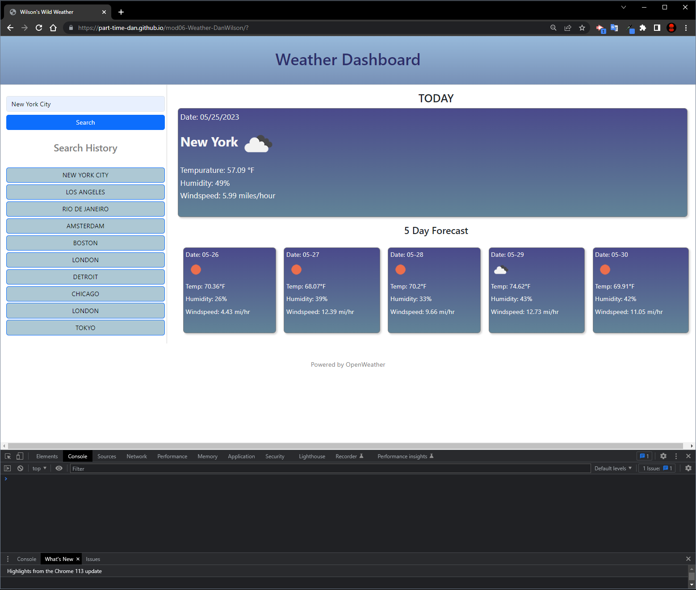

# mod06-Weather App-DanWilson

## Description
Module 06 challenge for bootcamp to create a dynamic weather app that searches by city and returns the current weather and a 5 day forecast.

Objectives:

- Use and call an API to generate the data shown on screen
- Weather dashboard should have a form input to enter city names with the click of a search button
- Searching for each city should display current and future conditions and add that city to the search history
- Data shown should include city name, date, icons representing weather conditions, tempurature, humidity, and windspeed
- Clicking in the search history should bring up that city's information again

## Issues

(CLOSED) ~~As of deployment, the search history buttons returning a new query is not functional. Working to add this feature.~~

## Installation

N/A

## Usage

Visit the site here [Wilson's Wild Weather](https://part-time-dan.github.io/mod06-Weather-DanWilson/)

Simply type the name of a city and using the cursor, click on the "search" button to return the results (Criteria didn't specify if the "submit" function was required). If no input is detected, the app will display an alert. Each search will generate a button in your search history sidebar and store this value locally. Click on the button to view that city again. 

Open the console to view the search history array and verify it is updating, but not duplicating the user's inputs. This will help unclutter the search history each page refresh.

## What I Learned

- This project (with much trial and error) helped me better understand the importance of scope and handling functions and pass throughs more efficiently. If more time were available, I would have attempted to further refine the API calls into smaller blocks.
- This also helped me strengthen my understanding and application of event listeners for handling multiple conditions or triggers of the same event.
- Specifically while working on generating the search history buttons, I discovered some behaviors of event listener "on clicks" I never knew about. Likely because I don't know a better way to create a container for JS generated content, the container itself stored the values so clicking BETWEEN the buttons in the white space returned a string of the entire search history array. I corrected this issue by setting the container to hidden which caused the buttons to also hide, so then I added an additional overriding CSS attribute to unhide the buttons. The buttons remained accessible but the trash data inside the container no longer interfered with getting values.
- This also lead me to discover the "click" event in particular can be dragged and grab multiple values whiel held, which led to me opting to use "mousedown" so the button click event only registered on the down press of the mouse button.
- Learned a bit about fetching API calls and also sourcing variables from links, which was the method used for getting and displaying the icons directly from OpenWeather's icon library. Since these are dynamic icons, I didn't create ALT content for them this time.

## Third Party Tools

Free API tools with limited calls provided by [OpenWeather](https://openweathermap.org/api).
[Day.js](https://day.js.org/) used for some date formatting shown in weather cards.
And [Bootstrap](https://getbootstrap.com/) was used for formatting, layout and all sidebar styling.

## License

N/A

## Deploy Git Page Screenshot

